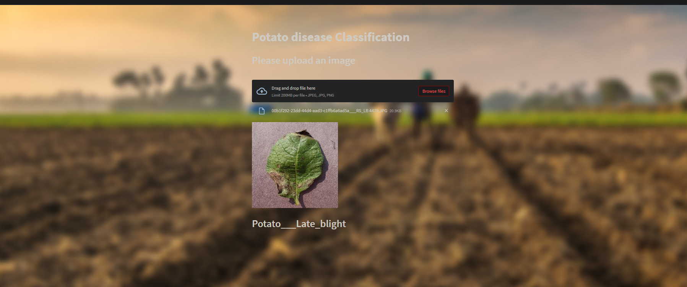

## Basic Overview
This project implements a deep learning model using TensorFlow to classify diseases in potato plants based on image inputs. It is deployed as a user-friendly web application with Streamlit, 
enabling users to upload images and receive instant predictions.
  

# Dataset
Available here  on kaggle : [Plant Village Dataset on Kaggle](https://www.kaggle.com/datasets/arjuntejaswi/plant-village)

## Problem Statement 
Farmers who grow potatoes are facing significant economic losses every year due to various diseases that can affect potato plants. Two common diseases are:
 - Early Blight, which is caused by a fungus.
 - Late Blight, which is caused by a specific microorganism.

   
If farmers can detect these diseases early and apply the appropriate treatment, it can save a lot of waste and prevent economic loss.
The treatment for Early Blight and Late Blight is slightly different, making it crucial to accurately identify between the two.

## About Web App
After training the CNN model, I integrated it into a web application that allows farmers to upload images of their potato plants to assess their health. The model accurately predicts whether the plants are affected by Early Blight, Late Blight, or are healthy, providing instant feedback. This empowers farmers to make timely decisions, improving disease management and minimizing crop losses.

### Labels :
     - 0 Potato___Early_blight
     - 1 Potato___Late_blight
     - 2 Potato___healthy

## Screenshot from WebApp :  [here](https://github.com/mennaafi/Potato-disease-Classification-WebApp/tree/master/screenshotfromapp)

## Requirements :
  - numpy ==1.23.5
  - streamlit==1.22.0
  - pillow == 9.5.0
  - keras==2.12.0
  - tensorflow==2.12.0

